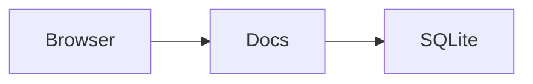

# Diagrams

## Mermaid

Use a `mermaid` fenced block for a diagram preview in notes and public links.
The code icon edits the source; zoom, drag to pan, or expand for a larger view.
Invalid syntax shows an error without changing your Markdown. Diagram scripts,
external resources and clickable links are disabled. Limit: 50,000 characters.

````markdown

````

## Archify

Use an `archify` fenced code block. Docs renders its JSON as an interactive SVG.
The code icon edits the source, and the expand icon opens a larger preview.
Drag to pan, pinch to zoom, or use the zoom/reset buttons. Keyboard: `+`, `-`, `0`
and arrow keys. In the expanded preview, the mouse wheel also zooms; inline,
hold Ctrl/Cmd so normal scrolling still moves the document. Escape closes the preview.

````markdown
```archify
{
  "schema_version": 1,
  "diagram_type": "architecture",
  "meta": { "title": "Request flow" },
  "components": [
    { "id": "client", "type": "external", "label": "Client", "pos": [40, 60], "size": [160, 64] },
    { "id": "api", "type": "backend", "label": "API", "pos": [320, 60], "size": [160, 64] }
  ],
  "connections": [{ "from": "client", "to": "api", "label": "HTTPS" }]
}
```
````

This is a small architecture-only adaptation, not the full Archify renderer.
It supports component positions/sizes, labels/sublabels/tags, grid placement,
boundary groups, connection variants, endpoint sides, explicit bends (`via`),
straight/orthogonal routes, and label positions. Automatic routes use simple
doglegs; use `via` to route around other boxes. Layout does not reflow on phones.
Other diagram types and schema versions show an error. Viewer settings, brand
assets, cards, animations, legends and quality checks are not imported.

Limits: 100,000 characters, 150 components, 300 connections, 40 boundaries.
JSON stays in Markdown through saves, exports and MCP reads/updates. Plain `json`
blocks are unchanged. Labels are rendered as text, never HTML; no user scripts,
remote fonts, images or network requests are used to render diagrams.

Geometry is adapted from [Archify](https://github.com/tt-a1i/archify) commit
`9e35d2b0b39b155553ba9fcfe0b4f2a5198dd993`; attribution is retained in
[`public/assets/archify.txt`](../public/assets/archify.txt).
